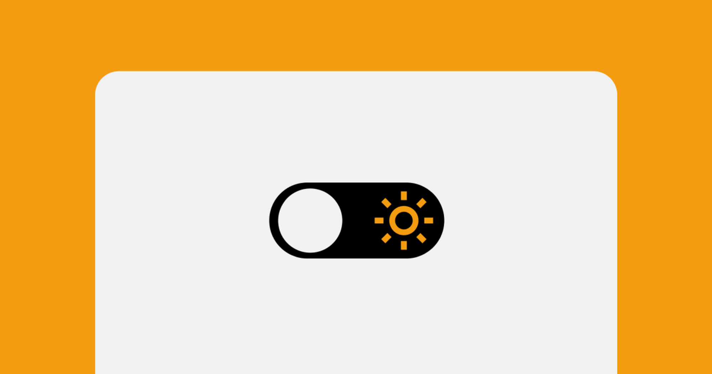

<h1 align="center">Theme Switcher</h1>

    <a href="#-tecnologias">Tecnologias</a>&nbsp;&nbsp;&nbsp;|&nbsp;&nbsp;&nbsp;
    <a href="#-projeto">Projeto</a>&nbsp;&nbsp;&nbsp;|&nbsp;&nbsp;&nbsp;
    <a href="#-layout">Layout</a>&nbsp;&nbsp;&nbsp;|&nbsp;&nbsp;&nbsp;
    <a href="#memo-licença">Licença</a>

    

 

    

## :rocket: Tecnologias

Esse projeto foi desenvolvido com as seguintes tecnologias: 

- HTML e CSS
- Git e Github
- JavaScript

## :computer: Projeto

Página web com um toggle central para alterar entre os temas "claro" e "escuro".

## 🔖 Layout

Você pode visualizar o layout original do projeto através [DESSE LINK](https://www.figma.com/community/file/1241117469370182245/Theme-Switcher-%E2%80%A2-Desafio-Discover). É necessário ter conta no [Figma](https://figma.com) para acessá-lo.

## :memo: Licença

Esse projeto está sob a licença MIT.

---
